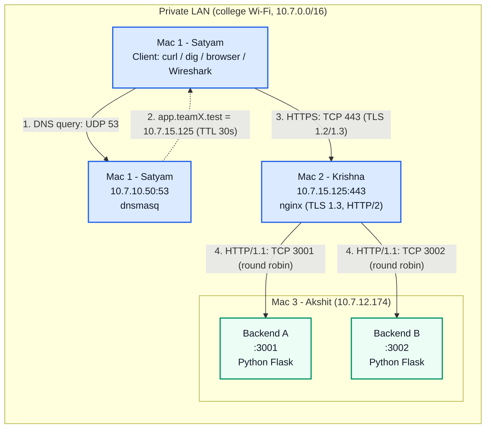

# Private Network Service

A private, secure and load-balanced network platform built across **3 Macs** for the Computer Networks course project.

The platform demonstrates a complete, isolated private request pipeline:

1. **Private Name Resolution:** clients query a private DNS server (`dnsmasq`) for `app.teamX.test`, which answers with a 30s TTL. The name does not exist on public DNS.
2. **Secure Transport (TLS):** clients make a trusted HTTPS connection (TLS 1.2 / 1.3 over TCP 443) using a local mkcert certificate authority.
3. **Reverse Proxy & Load Balancing:** an `nginx` edge terminates TLS, speaks HTTP/2, and distributes requests round-robin across two Python REST backends, with automatic failover.
4. **Caching & Conditional Requests:** `Cache-Control: public, max-age=60`, `ETag`, and `304 Not Modified`.
5. **Packet Inspection:** Wireshark captures of DNS, the TCP 3-way handshake and the TLS handshake and records.

---

## Project members

| Name              | Enrollment | Mac   | Role & Responsibilities                                                        |
| ----------------- | ---------- | ----- | ------------------------------------------------------------------------------ |
| **Satyam Kumar**  | 2401010428 | Mac 1 | **Tech Lead**. Private DNS server (`dnsmasq`), test client, Wireshark captures |
| **Krishna Verma** | 2401010240 | Mac 2 | Edge reverse proxy: nginx TLS / HTTPS / HTTP/2 load balancer, mkcert CA        |
| **Akshit Vats**   | 2401020085 | Mac 3 | Backend servers A (port 3001) and B (port 3002), Python Flask REST API         |

---

## Architecture



---

## Network Inventory

| Node                            | Member        | Address & Port           | Service      | Protocol                                 |
| ------------------------------- | ------------- | ------------------------ | ------------ | ---------------------------------------- |
| **Mac 1**: Private DNS + client | Satyam Kumar  | `10.7.10.50:53`          | `dnsmasq`    | DNS over UDP/TCP 53                      |
| **Mac 2**: Edge & load balancer | Krishna Verma | `10.7.15.125:80`, `:443` | `nginx`      | HTTPS (TLS 1.2/1.3, HTTP/2) over TCP 443 |
| **Mac 3**: Backend A            | Akshit Vats   | `10.7.12.174:3001`       | Python Flask | HTTP/1.1 over TCP                        |
| **Mac 3**: Backend B            | Akshit Vats   | `10.7.12.174:3002`       | Python Flask | HTTP/1.1 over TCP                        |

> The IPs are DHCP leases on college Wi-Fi and can change between sessions. Each Mac keeps its own `team/team.env` (copied from `team/team.env.example`, not committed).
> Run `scripts/get-my-ip.sh` on each Mac before every session.

---

## Repository Structure

```text
.
├── README.md                 # Project overview (this file)
├── video_demo.md             # Video script: curl commands + Wireshark capture walkthrough
├── backend/
│   ├── app.py                # REST endpoints: /, /api/status, /api/cache
│   └── requirements.txt
├── nginx/
│   ├── nginx.conf.template   # Generic template
│   └── cn-project.conf       # Config used on Mac 2
├── dnsmasq/
│   └── dnsmasq.conf.template
├── tls/
│   └── mkcert-rootCA.pem     # PUBLIC mkcert CA cert (to trust on client Macs). No private keys.
├── scripts/
│   ├── get-my-ip.sh
│   ├── run-backend.sh
│   └── smoke-test.sh
├── team/
│   ├── team.env.example
│   └── team.env              # Local only (gitignored): copy of the example with current IPs
├── docs/                     # Additional docs (architecture, demo commands, TLS setup)
└── evidence/                 # Wireshark captures and screenshots
```

---

## Quick Start

Start the services on each Mac:

```bash
# Mac 3 (backends): two terminals
./scripts/run-backend.sh A
./scripts/run-backend.sh B

# Mac 2 (edge)
sudo nginx -t && sudo brew services restart nginx

# Mac 1 (DNS)
sudo brew services restart dnsmasq
```

## Quick Verification (from Mac 1)

```bash
# 1. Private DNS
dig @10.7.10.50 app.teamX.test          # A 10.7.15.125, TTL 30
dig @8.8.8.8   app.teamX.test           # NXDOMAIN (private only)

# 2. Backends directly
curl -i http://10.7.12.174:3001/api/status   # X-Backend: A
curl -i http://10.7.12.174:3002/api/status   # X-Backend: B

# 3. Trusted HTTPS through the edge (no -k)
curl -v https://app.teamX.test/api/status    # TLSv1.3, h2, "SSL certificate verify ok"
curl --http1.1 -I https://app.teamX.test/api/status
curl --http2   -I https://app.teamX.test/api/status

# 4. Round-robin load balancing
for i in 1 2 3 4 5 6; do curl -s https://app.teamX.test/api/status; echo; done

# 5. Caching & ETag
curl -I https://app.teamX.test/api/cache
curl -i -H 'If-None-Match: "cn-cache-v1"' https://app.teamX.test/api/cache   # 304
```

## Verified Results

| Test           | Result                                                                              |
| -------------- | ----------------------------------------------------------------------------------- |
| Private DNS    | `app.teamX.test → 10.7.15.125`, TTL 30; `NXDOMAIN` on 8.8.8.8                       |
| Trusted HTTPS  | TLS 1.3, ALPN `h2`, issuer mkcert CA, `SSL certificate verify ok`, `HTTP/2 200`     |
| HTTP versions  | `HTTP/1.1 200 OK` and `HTTP/2 200`                                                  |
| Load balancing | Requests alternate between backends B, A, B, A, …                                   |
| Caching        | `ETag: "cn-cache-v1"`, `Cache-Control: public, max-age=60`, conditional GET → `304` |
| Failover       | Backend A stopped → 8/8 requests served by B with no errors                         |

---

## Notes & Lessons Learned

- **Managed (college) Macs:** the firewall is enforced by MDM and can't be changed. It still allows incoming connections to signed software: the python.org Python (signed by the PSF), and dnsmasq/nginx worked as well. No firewall changes were needed.
- **DHCP IP changes:** Mac 3 moved from `.172` to `.174` mid-setup, which caused `504 Gateway Time-out` on nginx. Always re-check IPs.
- **DNS on the client:** `/etc/resolver/teamX.test` sends only `*.teamX.test` to the private DNS, so normal internet access keeps working.

## Documentation

- [Video demo + Wireshark guide](video_demo.md)
- [TLS & Keychain Trust Guide](docs/tls-setup.md)
- [Demonstration Commands](docs/demo-commands.md)
